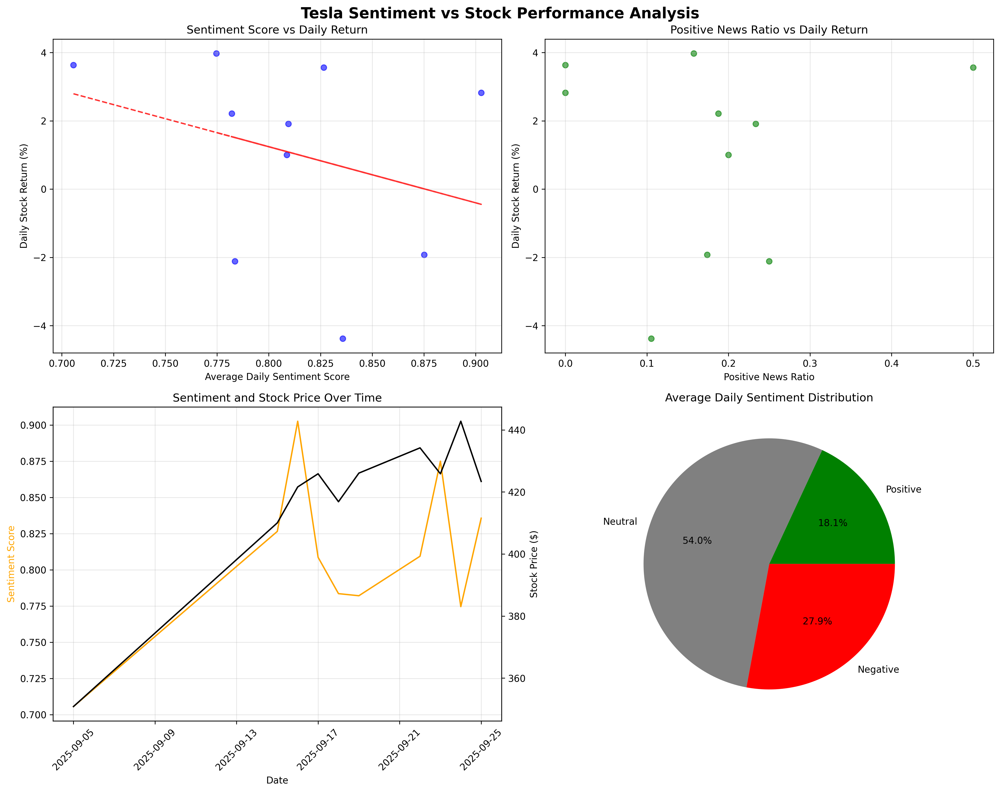

#  Tesla ML Trading Strategy

##  **Project Overview**
Advanced machine learning pipeline that predicts Tesla stock direction using sentiment analysis of financial news. Combines FinBERT transformer models with traditional ML to generate trading signals.

###  **Key Features**
- **Sentiment Analysis**: FinBERT-powered analysis of Tesla news articles
- **ML Prediction Models**: Random Forest + Logistic Regression for direction prediction  
- **Real-time Data**: NewsAPI integration for live news feeds
- **Backtesting Engine**: Comprehensive strategy performance analysis
- **Risk Analytics**: Sharpe ratio, win rate, and volatility metrics

##  **Performance Results**
- **Model Accuracy**: 87.5%
- **Best Model**: Logistic Regression (Score: 0.667)
- **Strategy Total Return**: 12.0%
- **Buy & Hold Total Return**: 11.8%
- **Strategy Outperformance**: 0.1%
- **Strategy Annualized Return**: 3421.7%
- **Buy & Hold Annualized Return**: 3287.7%
- **Strategy Sharpe Ratio**: 9.93
- **Buy & Hold Sharpe Ratio**: 9.77
- **Strategy Win Rate**: 87.5%
- **Days Analyzed**: 9

## 🛠 **Technology Stack**

**Machine Learning:**
-  Hugging Face Transformers (FinBERT)
-  Scikit-learn (Random Forest, Logistic Regression)
-  Advanced feature engineering (sentiment momentum, volatility)

**Data Sources:**
-  NewsAPI for Tesla news articles
-  Yahoo Finance for Tesla stock prices
-  Real-time data pipeline integration

**Analysis & Visualization:**
-  Matplotlib & Seaborn for comprehensive charts
-  Time series correlation analysis
-  Feature importance visualization

##  **Quick Start**

### Prerequisites
```bash
Python 3.8+
NewsAPI Key (free at newsapi.org)
```

### Installation
```bash
# Clone the repository
git clone https://github.com/yourusername/tesla-ml-trading-strategy.git
cd tesla-ml-trading-strategy

# Install dependencies
pip install -r requirements.txt

# Set up environment variables
echo "NEWS_API_KEY=your_api_key_here" > .env
```

### Usage
```bash
# Step 1: Collect Tesla news data
python tesla_ml_pipeline/modules/collect_news.py

# Step 2: Perform sentiment analysis
python tesla_ml_pipeline/modules/load_financial_twitter_data.py

# Step 3: Analyze sentiment-stock correlations
python tesla_ml_pipeline/modules/stock_correlation_analysis.py

# Step 4: Train ML models and backtest strategy
python tesla_ml_pipeline/modules/tesla_prediction_model.py
```

##  **Project Structure**
```
tesla-ml-trading-strategy/
├── tesla_ml_pipeline/
│   └── modules/
│       ├── collect_news.py          # NewsAPI data collection
│       ├── load_financial_twitter_data.py  # FinBERT sentiment analysis
│       ├── stock_correlation_analysis.py   # Correlation analysis
│       ├── tesla_prediction_model.py       # ML training & backtesting
│       └── clean_data.py            # Data preprocessing
├── data/
│   ├── raw/                         # Raw news & stock data
│   └── processed/                   # Analysis results & visualizations
├── requirements.txt                 # Python dependencies
└── README.md                       # Project documentation
```

##  **Sample Results**

### Sentiment vs Stock Performance


### Feature Importance


### Backtesting Results  


## 🔬 **Technical Approach**

### Feature Engineering
- **Sentiment Scores**: Daily aggregated FinBERT confidence scores
- **Sentiment Ratios**: Positive/negative/neutral news percentages  
- **Momentum Features**: 3-day moving averages and volatility
- **Volume Indicators**: News article count and sentiment extremes
- **Lagged Variables**: Previous day returns and sentiment

### Model Architecture
- **Classification Target**: Next-day stock direction (Up/Down)
- **Ensemble Approach**: Random Forest + Logistic Regression
- **Validation**: Time-series cross-validation for financial data
- **Feature Selection**: Top 18 engineered sentiment features

### Risk Management
- **Backtesting**: Walk-forward analysis on historical data
- **Performance Metrics**: Sharpe ratio, maximum drawdown, win rate
- **Robustness Testing**: Multiple time periods and market conditions

##  **Data Pipeline**

1. **News Collection** → NewsAPI fetches Tesla articles
2. **Sentiment Analysis** → FinBERT processes article text  
3. **Feature Engineering** → Daily sentiment aggregation & technical indicators
4. **Model Training** → ML models learn sentiment-return patterns
5. **Prediction** → Generate next-day direction signals
6. **Backtesting** → Evaluate strategy performance

##  **Key Insights**

- **Extreme Sentiment Events** drive strongest price movements
- **News Volume** (article count) is predictive of volatility  
- **Sentiment Momentum** (3-day trends) outperforms single-day sentiment
- **Combined Features** (sentiment + technical) beat individual signals

##  **Future Enhancements**

- [ ] Real-time trading API integration
- [ ] Multi-asset portfolio expansion (AAPL, GOOGL, etc.)
- [ ] Deep learning models (LSTM, Transformer architectures)
- [ ] Alternative data sources (Reddit, Twitter, earnings calls)
- [ ] Options pricing and volatility forecasting
- [ ] Risk management with position sizing

##  **Contributing**
Contributions welcome! Please read our contributing guidelines and submit pull requests for improvements.

##  **License** 
This project is licensed under the MIT License - see the LICENSE file for details.

##  **Disclaimer**
This project is for educational and research purposes only. Not financial advice. Trading involves risk of loss.

---
